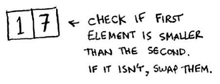
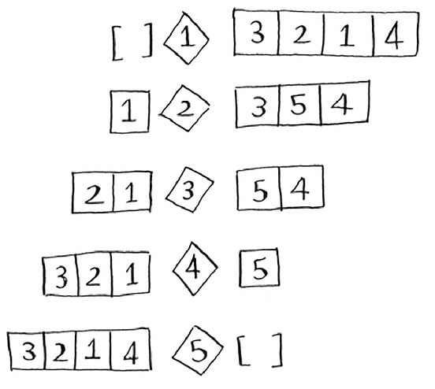
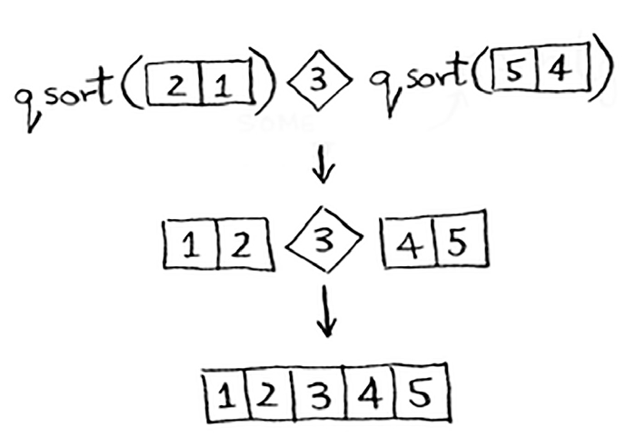

# **AULA : MÉTODO "DIVIDIR PARA CONQUISTAR" E O ALGORITMO QUICKSORT**
# Análise de Algoritmos - Fatec Dep. Ary Fossen (Jundiaí)

**Prof. Dr. Humberto A. P. Zanetti**
---

## Método "Dividir para Conquistar"

**Dividir para Conquistar** (ou "Divide and Conquer") é uma estratégia para resolver problemas complexos **dividindo-os em partes menores**, resolvendo cada parte separadamente, e depois combinando as soluções para obter a resposta final.

**Etapas do método:**
+ Dividir: Quebrar o problema original em subproblemas menores, que são versões menores do problema.
+ Conquistar: Resolver recursivamente cada subproblema.
+ Combinar: Reunir as soluções dos subproblemas para formar a solução final.

**Exemplo do cotidiano**: Organizar uma estante de livros dividindo por **tema**, depois por **autor**, depois por **ordem alfabética**.

## ANTES DE QUALQUER COISA: REVISÃO SOBRE RECURSIVIDADE!

**Exemplo básico: soma de um vetor (ou lista)!**
````python
def soma(lista):
    if lista == []:
        return 0
    return lista[0] + soma(lista[1:])

print(soma([2, 4, 6])) 
````
Vamos executar no [Python Tutor](https://pythontutor.com/)!

## Exemplo clássico: divisão de terras! 
*Exemplo retirado do livro "Entendendo Algoritmos", de Aditya Y. Bhargava*

A técnica Dividir para Conquistar (**DC**), mesmo tendo uma premissa simples, a sua compreensão pdoe não ser tão simples. Vamos tentar um exemplo mais "visual".   
Suponha que você é um fazendeiro que tenha a seguinte área para plantio:


Você quer dividir sua fazenda em porções **QUADRADAS IGUAIS**, sendo que estas porções devem ter o **MAIOR** tamanho possível!!!  
Assim, nenhuma das alternativas a seguir servem:


Vamos tentar descobrir o tamanho ideal co o método DC, seguindo 2 passos:
+ Descubrir o **caso-base**, que deve ser o caso mais imples possível;
+ Divida ou diminua o seu problema até que ela se torne o caso-base.

Qual é a maior largura possível para usar no quadraqdo? Primeiro, descubra o caso base. O caso mais fácil seria se um dos lados fosse múltiplo do outro lado.


Suponha que um dos lados tenha 25 metros (m) e o outro lado tenha 50 m. Então, a maior caixa que você pode usar é de 25 m × 25 m. Você precisa de duas dessas caixas para dividir o terreno.  
Agora você precisa descobrir o caso recursivo. É aqui que entra o método DC. De acordo com o método, a cada chamada recursiva, você precisa reduzir o seu problema.  
Como você reduz o problema aqui? Vamos começar marcando as maiores caixas que você pode usar.


Você pode encaixar duas caixas de 640 × 640 ali, e ainda sobra uma parte de terra para ser dividida. 
E vemos que **sobrou um segmento da fazenda para dividir**.  
Por que não aplicar o mesmo algoritmo a esse segmento?


Você começou com uma fazenda de 1680 × 640 que precisava ser dividida. **Mas agora você precisa dividir um segmento menor**, de 640 × 400.   
Se você encontrar o maior quadrado que se encaixa nesse novo tamanho, ele será o maior quadrado que também funciona para a fazenda inteira. 
**Você acabou de reduzir o problema**: de uma fazenda de 1680 × 640 para uma de 640 × 400!

Vamos aplicar o mesmo algoritmo novamente.  
Começando com uma fazenda de 640 × 400 m, o maior quadrado que você pode formar é de 400 × 400 m.


E isso deixa você com um segmento menor: 400 × 240 m.


E você pode desenhar um quadrado sobre essa área para obter um segmento ainda menor: 240 × 160 m.


E então, você desenha um quadrado sobre essa área para obter um segmento ainda **menor**.


Você chegou ao caso base: 80 é um fator de 160!
Se você dividir esse segmento usando quadrados, **não sobra nada!**


Então, para a fazenda original, o maior tamanho de lote que você pode usar é 80 × 80 m.


### **Um resumo *algorítmico:***

````python
def maior_quadrado(lado1, lado2):
    if lado1 == 0 or lado2 == 0:
        return 0
    elif lado1 % lado2 == 0:
        return lado2
    else:
        return maior_quadrado(lado2, lado1 % lado2)

print(maior_quadrado(1680, 640)) 

````

## O Algoritmo *QuickSort*

*Quicksort* (QS) é um algoritmo de ordenação. Ele é muito mais rápido do que o *Selection Sort* (que tem um desempenho razoável) e é frequentemente usado em aplicações reais.  
Por exemplo, a biblioteca padrão da linguagem C possui uma função chamada `qsort`, que é sua implementação do QS (e é usado em diversas soluções *hardcore*, como em competições de programação, quando possível). O QS também usa o método "Dividir parar Conquistar".  
Vamos usar o QS para ordenar um array. Qual é o array mais simples que um algoritmo de ordenação pode lidar?


**Arrays vazios e arrays com apenas um elemento** serão o caso base.
Você pode simplesmente retornar esses arrays como estão — não há nada para ordenar.  
````python
def qsort(array):
    if len(array) < 2:
        return array
````

Essa é a base do QS: 
+ Se o array tem 0 ou 1 elemento, ele já está ordenado.
+ Esses casos não exigem mais divisões (ou chamadas recursivas).

Um array com dois elementos também é bem fácil de ordenar.



E 3 elementos???  


Usando o método **Dividir para Conquistar**, você quer dividir esse array até chegar ao caso base.  

**Aqui está como o QS funciona:**
Primeiro, escolha um elemento do array. Esse elemento é chamado de **pivô** (*pivot*).  
  

Falaremos sobre como escolher um bom pivô mais adiante.
Por enquanto, vamos supor que o primeiro item do array seja o pivô.
Agora, encontre os elementos menores que o pivô e os elementos maiores que o pivô.

  

Isso é chamado de **particionamento** (*partitioning*). Agora você tem:
+ Um subarray com todos os números menores que o pivô
+ O pivô
+ Um subarray com todos os números maiores que o pivô

Os dois subarrays não estão ordenados. Eles apenas foram particionados.  
Mas se eles estivessem ordenados, então ordenar o array inteiro seria bem fácil.  
Essa é a essência da abordagem **Dividir para Conquistar** no QS: **dividir o problema em partes menores (mesmo que ainda desordenadas) e aplicar a mesma ideia recursivamente.**  

Se os subarrays estiverem ordenados, então você pode juntar tudo assim —
**array da esquerda** + **pivô** + **array da direita** — e você terá um **array ordenado**.

Neste caso, é:  `[10, 15] + [33] + [] = [10, 15, 33]`, que é um array ordenado.

**Como você ordena os subarrays?**
O caso base do QS já sabe como ordenar arrays com dois elementos (como o subarray da esquerda) e arrays vazios (como o da direita).

Então, se você **chamar o QS recursivamente nos dois subarrays e depois juntar os resultados, você obtém um array ordenado!**  
````
Vetor original: [33, 15, 10]
1. Escolha o pivô
O primeiro elemento é o pivô:
Pivô = 33

2. Particione os elementos
Menores que 33: [15, 10]

Pivô: [33]

Maiores que 33: []

Agora temos:
 - Subarray esquerdo: [15, 10]
 - Pivô: 33
 - Subarray direito: []

Aplicando quicksort no subarray [15, 10]
1. Pivô = 15
Menores que 15: [10]

Pivô: [15]

Maiores que 15: []

Agora temos:
[10] + [15] + [] = [10, 15]

Combinando tudo:
Subarray esquerdo ordenado: [10, 15]

Pivô: [33]

Subarray direito: []

Resultado final:
[10, 15, 33]
````
  

Isso funcionará com **qualquer pivô**. Suponha que você escolha **15 como pivô**, por exemplo.  

  

Ambos os subarrays têm apenas um elemento, e você sabe como ordená-los.  
Então, agora você sabe como ordenar um array com três elementos. Aqui estão os passos:  
1. Escolha um pivô.
2. Particione o array em dois subarrays: elementos menores que o pivô e elementos maiores que o pivô.
3. Chame o QS recursivamente nos dois subarrays.

E o que acontece com um array de quatro elementos?  

  
 
Suponha que seja escolhido o 33 como pivô novamente.  

  

O array à esquerda tem três elementos. Você já sabe como ordenar um array de três elementos:
basta chamar o QS recursivamente sobre ele.

  

Então, você pode ordenar um array de quatro elementos. E se você pode ordenar um array de quatro elementos, pode ordenar um array de cinco elementos.  
Por que isso acontece?  
Suponha que você tenha esse array de cinco elementos.  

  

Aqui estão todas as maneiras de particionar este array, dependendo de qual pivô você escolher.  

  

Note que todos esses subarrays têm entre **0 e 4 elementos**. E você já sabe como ordenar um array com 0 a 4 elementos usando QS!  
Então, não importa qual pivô você escolha, você pode chamar QS recursivamente nos dois subarrays.  

Por exemplo, suponha que você escolha **3 como pivô**. Você chama QS nos subarrays.

  

Os subarrays são ordenados, e então você combina tudo para obter um array ordenado. Isso funciona mesmo que você escolha **5 como pivô**.

  

Isso funciona com qualquer elemento como pivô.  
Portanto, você pode ordenar um array de 5 elementos.  
Usando a mesma lógica, você pode ordenar um array de seis elementos, e assim por diante.  

## Implementação

````python
def quicksort(array):
    # Caso base: se o array tem 0 ou 1 elemento, já está ordenado
    if len(array) <= 1:
        return array
    
    # Escolher o pivô. Aqui, vamos escolher o primeiro elemento como pivô
    pivot = array[0]
    
    # Criar subarrays para os elementos menores, iguais ou maiores que o pivô
    left = [x for x in array[1:] if x < pivot]  # Elementos menores que o pivô
    right = [x for x in array[1:] if x >= pivot]  # Elementos maiores ou iguais ao pivô
    
    # Chamar recursivamente quicksort nos subarrays e combinar os resultados
    return quicksort(left) + [pivot] + quicksort(right)

````

## Notação BIG O e o caso médio e pior caso

Quicksort é único porque sua velocidade depende do pivô que você escolhe, o que faz com que sua performance mude conforme a escolha.  

  
**Baseado em um computador lento, de 10 operações por segundo.*

| Complexidade de Tempo | Nome                        | Exemplo                         |
|-----------------------|-----------------------------|----------------------------------|
| O(1)                  | Tempo constante              | Acessar um item em uma lista     |
| O(log n)              | Logarítmico                  | Busca binária                    |
| O(n)                  | Linear                       | Percorrer uma lista              |
| O(n log n)            | Linearítmico                 | Quicksort, mergesort             |
| O(n²)                 | Quadrática                   | Bubble sort, selection sort      |
| O(2ⁿ)                 | Exponencial                  | Problemas de conjuntos (brute force) |
| O(n!)                 | Fatorial                     | Problemas de permutação completa |

O QS tem uma particularidade em que seu **pior caso** ele toma O(n²), sendo tão lento quanto os piores algoritmos de ordenação. Já em seu **caso médio**, ele assume O(n log n).  
Então a pode assumir que o **Merge Sort** é uma melhor escolha que o QS???

**Caso médio e pior caso**

A performance do QS depende fortemente do pivô que você escolhe. Suponha que você sempre escolha o primeiro elemento como pivô. E você chama o QS com um vetor que já está ordenado. O QS não verifica se o vetor de entrada já está ordenado. Então, ele ainda tentará ordená-lo.  


Perceba como você não está dividindo o vetor em duas metades.
Em vez disso, uma das sub-listas (subarrays) está sempre vazia.
Então, a pilha de chamadas (*call stack*) fica muito longa.

Agora, suponha que você sempre escolhesse o elemento do meio como pivô.
Veja como fica a pilha de chamadas nesse caso:
+ A divisão é mais equilibrada, ou seja, os dois subarrays têm tamanhos semelhantes.
+ Isso resulta em uma profundidade menor da pilha de chamadas.
+ E, consequentemente, em melhor desempenho do algoritmo.  


É muuito mais rápido!  
Porque você divide o vetor pela metade a cada vez, não precisa fazer tantas chamadas recursivas.
Você atinge o caso base mais rapidamente, e a pilha de chamadas fica muito menor.

O primeiro exemplo que você viu é o pior caso, e o segundo exemplo é o melhor caso.  
No pior caso, o tamanho da pilha é O(n).  
No melhor caso, o tamanho da pilha é O(log n).  

Agora, observe o primeiro nível da pilha:  
Você escolhe um elemento como pivô, e o restante dos elementos é dividido em subarrays.  
Você "toca" todos os oito elementos do vetor.  
Portanto, essa primeira operação leva O(n) tempo.  

Na verdade, você tem O(n) elementos em todos os níveis da pilha de chamadas.


Mesmo que você particione o vetor de forma diferente, ainda assim estará lidando com O(n) elementos a cada etapa.  
Ou seja, em cada nível da recursão, você percorre todos os elementos para dividi-los em torno do pivô.  
Isso significa que, independente da escolha do pivô, o custo de cada nível da pilha é O(n).


A diferença entre o melhor e o pior caso está na quantidade de níveis da recursão:
+ Melhor caso: altura da pilha ≈ log n, então tempo total é O(n log n)
+ Pior caso: altura da pilha ≈ n, então tempo total é O(n²)


**Rodando melhor caso e pior caso**

````python
import time
import random
import sys

# Aumentar o limite de recursão para suportar vetores maiores (opcional, mas com cautela)
sys.setrecursionlimit(2000)

# Quicksort com o primeiro elemento como pivô (pior caso se o vetor estiver ordenado)
def quicksort_pior_caso(arr):
    if len(arr) <= 1:
        return arr
    else:
        pivo = arr[0]
        menores = [x for x in arr[1:] if x <= pivo]
        maiores = [x for x in arr[1:] if x > pivo]
        return quicksort_pior_caso(menores) + [pivo] + quicksort_pior_caso(maiores)

# Quicksort com pivô no meio (melhor caso em muitos cenários)
def quicksort_melhor_caso(arr):
    if len(arr) <= 1:
        return arr
    else:
        meio = len(arr) // 2
        pivo = arr[meio]
        menores = [x for i, x in enumerate(arr) if x < pivo and i != meio]
        maiores = [x for i, x in enumerate(arr) if x >= pivo and i != meio]
        return quicksort_melhor_caso(menores) + [pivo] + quicksort_melhor_caso(maiores)

# Criando um vetor com 1000 elementos para teste
ordenado = list(range(1000))  # Pior caso para quicksort com pivô fixo
aleatorio = ordenado.copy()
random.shuffle(aleatorio)     # Melhor caso mais provável

# Medindo tempo do pior caso
inicio_pior = time.time()
quicksort_pior_caso(ordenado)
fim_pior = time.time()

# Medindo tempo do melhor caso
inicio_melhor = time.time()
quicksort_melhor_caso(aleatorio)
fim_melhor = time.time()

# Resultados
tempo_pior = fim_pior - inicio_pior
tempo_melhor = fim_melhor - inicio_melhor

tempo_pior, tempo_melhor

````

**Rodando melhor caso e pior caso**

````python
# Quicksort com o primeiro elemento como pivô (pior caso se o vetor estiver ordenado)
def quicksort_pior_caso(arr):
    if len(arr) <= 1:
        return arr
    else:
        pivo = arr[0]
        menores = [x for x in arr[1:] if x <= pivo]
        maiores = [x for x in arr[1:] if x > pivo]
        return quicksort_pior_caso(menores) + [pivo] + quicksort_pior_caso(maiores)

# Quicksort com pivô aleatório (médio caso)
def quicksort_medio_caso(arr):
    if len(arr) <= 1:
        return arr
    else:
        pivo = random.choice(arr)  # Pivô aleatório para representar o médio caso
        menores = [x for x in arr if x < pivo]
        maiores = [x for x in arr if x > pivo]
        return quicksort_medio_caso(menores) + [pivo] + quicksort_medio_caso(maiores)

# Criando um vetor com 1000 elementos para teste
ordenado = list(range(1000))  # Pior caso para quicksort com pivô fixo
aleatorio = ordenado.copy()
random.shuffle(aleatorio)     # Médio caso (vetor embaralhado)

# Medindo tempo do pior caso
inicio_pior = time.time()
quicksort_pior_caso(ordenado)
fim_pior = time.time()

# Medindo tempo do médio caso
inicio_medio = time.time()
quicksort_medio_caso(aleatorio)
fim_medio = time.time()

# Resultados
tempo_pior = fim_pior - inicio_pior
tempo_medio = fim_medio - inicio_medio

tempo_pior, tempo_medio
````